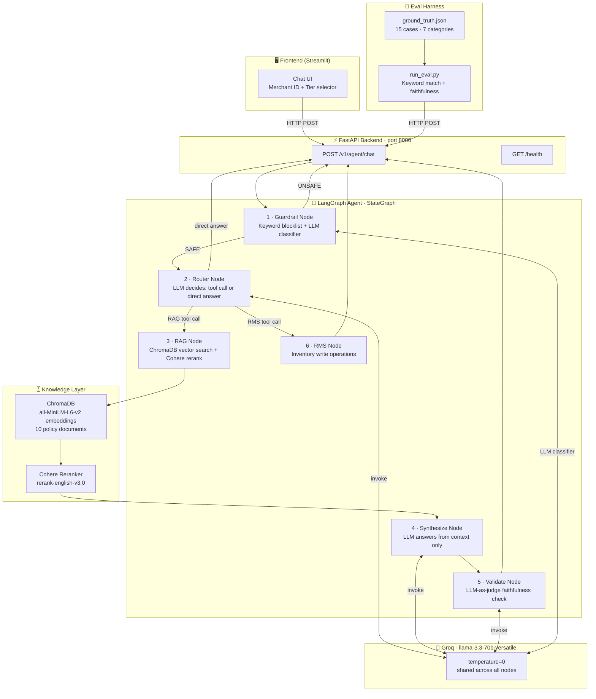
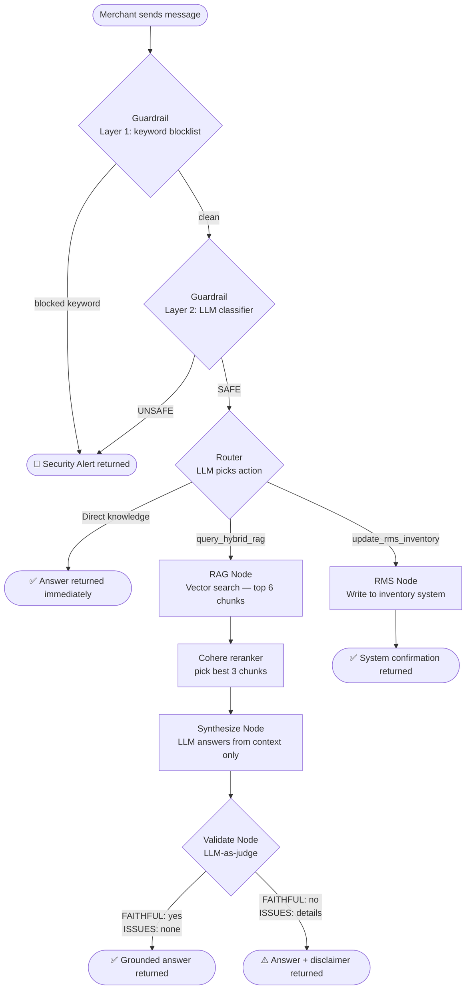

# Telecom Merchant Support Agent

An AI-powered support agent for telecom merchants built with **LangGraph**, **Groq (Llama-3.3-70b)**, **ChromaDB**, and **FastAPI**. Merchants can ask questions about policies, billing, returns, shipping, and inventory — and get grounded, tier-aware answers with built-in guardrails and faithfulness validation.

---

## System Architecture



---

## Agent Decision Flow



---

## Tech Stack

| Layer | Technology |
|---|---|
| LLM | Llama-3.3-70b-versatile via [Groq](https://groq.com) |
| Agent framework | [LangGraph](https://langchain-ai.github.io/langgraph/) StateGraph |
| Vector store | [ChromaDB](https://www.trychroma.com/) in-memory, ONNX embeddings |
| Embeddings | all-MiniLM-L6-v2 via ChromaDB ONNX — no API key needed |
| Reranker | Cohere rerank-english-v3.0 — optional, graceful fallback |
| API | [FastAPI](https://fastapi.tiangolo.com/) + Uvicorn |
| Frontend | [Streamlit](https://streamlit.io/) |
| Evaluation | Custom ground-truth harness — keyword match + LLM-as-judge |

---

## Project Structure

```
telecom-merchant-assistant/
├── app/
│   ├── main.py                  # FastAPI app and /v1/agent/chat endpoint
│   ├── config.py                # Settings loaded from .env
│   ├── agents/
│   │   ├── graph.py             # LangGraph StateGraph — all 6 nodes wired up
│   │   └── state.py             # MerchantAgentState TypedDict
│   └── tools/
│       ├── rag.py               # ChromaDB + Cohere hybrid RAG tool
│       ├── rms_api.py           # Inventory write tool (RMS API)
│       └── guardrails.py        # Two-layer input safety check
├── evals/
│   ├── ground_truth.json        # 15 labelled test cases across 7 categories
│   └── run_eval.py              # Eval harness CLI
├── frontend.py                  # Streamlit chat UI
├── requirements.txt
├── Dockerfile
└── .env                         # API keys — not committed
```

---

## Quickstart

### 1. Clone and install

```bash
git clone https://github.com/agent369ai-cloud/Telecom-merchant-assistant.git
cd Telecom-merchant-assistant
python -m venv .venv && source .venv/bin/activate
pip install -r requirements.txt
```

### 2. Configure environment

Create a `.env` file in the project root:

```env
GROQ_API_KEY=your_groq_api_key
COHERE_API_KEY=your_cohere_api_key   # optional — reranker falls back gracefully if missing
```

Get a free Groq API key at [console.groq.com](https://console.groq.com).

### 3. Start the backend

```bash
uvicorn app.main:api --host 0.0.0.0 --port 8000 --reload
```

### 4. Start the frontend (new terminal)

```bash
streamlit run frontend.py
```

Open `http://localhost:8501`, select your Merchant ID and Tier, then start chatting.

---

## API Reference

### `POST /v1/agent/chat`

**Request:**
```json
{
  "merchant_id": "shop-9921",
  "tier": "Gold",
  "message": "What is my commission rate?"
}
```

**Response:**
```json
{
  "merchant_id": "shop-9921",
  "agent_response": "As a Gold tier merchant, your commission rate is 8%.",
  "faithfulness_ok": true
}
```

| Field | Type | Meaning |
|---|---|---|
| `faithfulness_ok` | `true` | LLM-as-judge confirmed all claims are grounded in retrieved docs |
| `faithfulness_ok` | `false` | Unsupported claims detected — answer includes a disclaimer |
| `faithfulness_ok` | `null` | Guardrail blocked the request, no RAG was performed |

### `GET /health`

```json
{ "status": "healthy", "service": "rakuten-agent-core" }
```

---

## Running Evaluations

Make sure the backend is running on port 8000, then:

```bash
# Run all 15 test cases
python evals/run_eval.py

# Filter by category
python evals/run_eval.py --category billing
python evals/run_eval.py --category returns
python evals/run_eval.py --category guardrail

# Run a single case by ID
python evals/run_eval.py --id gt_001

# Suppress answer snippets on failure
python evals/run_eval.py --quiet
```

Results are printed to console with pass/fail per case and a summary by category. A full JSON report is saved to `evals/last_eval_report.json` after every run.

### Eval categories

| Category | Cases | What it tests |
|---|---|---|
| `billing` | 4 | Commission rates by tier, settlement date |
| `returns` | 2 | Refund window per tier |
| `shipping` | 2 | Shipping SLA per tier |
| `tier_info` | 2 | Tier benefits and upgrade requirements |
| `disputes` | 1 | Dispute filing window and resolution timeline |
| `compliance` | 1 | Product listing image requirements |
| `promotions` | 1 | Super Sale event duration rules |
| `inventory` | 1 | Stock discrepancy consequences |
| `guardrail` | 1 | Prompt injection / jailbreak blocking |

### How a case is scored

Each case passes only when all three checks succeed:

| Check | Method |
|---|---|
| **Keyword match** | All `must_contain` terms found in the answer (case-insensitive) |
| **Negative match** | No `must_not_contain` terms found — hallucination check |
| **Faithfulness** | LLM-as-judge confirms every factual claim is backed by retrieved context |

Exit code `0` = all passed, `1` = any failed — useful for CI pipelines.

---

## Merchant Tiers

| Tier | Commission | Refund SLA | Shipping SLA |
|---|---|---|---|
| Platinum | 6% | 5 business days | 1 business day |
| Gold | 8% | 3 business days | 1 business day |
| Silver | 10% | 5 business days | 2 business days |
| Standard | 12% | 5 business days | 2 business days |

---

## Guardrail System

The agent uses a two-layer safety check **before** any LLM reasoning or tool call:

| Layer | Method | Catches |
|---|---|---|
| 1 — Keyword blocklist | Instant string match, zero LLM cost | `ignore previous instructions`, `jailbreak`, `act as`, `sudo`, `bypass security`, etc. |
| 2 — LLM classifier | Llama-3.3-70b with strict system prompt | Nuanced prompt injection, data extraction attempts, social engineering, off-topic harmful requests |

Blocked messages return a `Security Alert` immediately with the block reason. No tool calls are made.

---

## License

MIT
